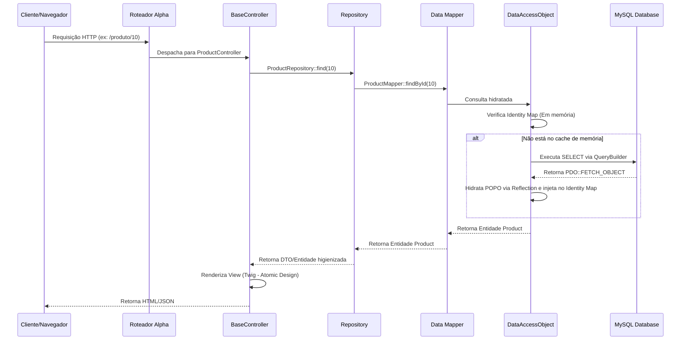

# 🏛️ Alpha Engine - Arquitetura e Engenharia de Software

## 1. Visão Geral
A **Alpha Engine** é um ecossistema de e-commerce totalmente independente e autônomo, construído sob o conceito de arquitetura standalone moderna. A decisão estratégica de **abandonar por completo a engine originaldo código legado** resultou no desenvolvimento de um sistema "do zero", abrangendo um novo bootstrap, router, controllers e views.

O motor foi projetado com forte isolamento de responsabilidades usando **Domain-Driven Design (DDD)**, **Repository Pattern** e **Data Mappers**. Toda a execução da aplicação (roteamento, manipulação de sessão, renderização e controle transacional) é nativa da Alpha Engine, eliminando a dependência do runtime legadodo código legado. Os arquivos legados deste último servem estritamente como referência conceitual e para migração de dados históricos.

---

## 2. Padrões de Projeto Aplicados

*   **Repository Pattern**: Centraliza a lógica de domínio e agregações de negócio. Os controladores interagem apenas com as interfaces dos repositórios, desacoplando a lógica de negócio do armazenamento físico de dados.
*   **Data Mapper**: Separação total entre as Entidades do Domínio e a infraestrutura de persistência. A lógica SQL está inteiramente contida nos Mappers.
*   **Identity Map**: Implementado no `DataAccessObject` (DAO) para atuar como cache em memória durante o ciclo de vida da requisição. Se a mesma entidade (ex: Produto ou Cliente) for solicitada múltiplas vezes, o DAO retorna a referência em memória RAM, extinguindo consultas repetitivas (N+1 queries).
*   **Proxy Pattern e Lazy Loading**: Relacionamentos complexos (como `#[ManyToOne]` ou coleções `#[OneToMany]`) utilizam classes Proxy e `LazyCollection` (via Closures). O banco de dados só é consultado quando a respectiva propriedade é explicitamente acessada na aplicação.
*   **Unit of Work**: O DAO encapsula o controle de transações (PDO `beginTransaction()`, `commit()`, `rollBack()`), assegurando atomicidade absoluta em operações que envolvem múltiplas tabelas (ex: criação de pedido acompanhada de atualização de estoque e gravação de cupons).

---

## 3. Topologia de Camadas

A Alpha Engine divide suas responsabilidades em camadas bem delineadas:

### 🏦 Camada de Banco de Dados:
*   Armazenamento dos dados brutos em banco relacional.

### 🛠️ Camada de Acesso a Dados - Data Access Object (DAO) (`core/Model/DataAccessObject/`):
*   Gerenciamento de conexões PDO estritas (usando `PDO::FETCH_OBJECT`).
*   Construção dinâmica de queries via `QueryBuilder` com proteção contra SQL Injection.
*   Hidratação automática de POPOs por meio de Reflection API.
*   Tratamento de mapeamento dinâmico de nomenclatura (`snake_case` do banco para `camelCase` no PHP).
*   Resolução automática de relacionamentos de associação.

### 🔄 Camada de Mapeamento - Data Mappers (`core/Mappers/`):
*   Traduzem os objetos genéricos do DAO para Entidades de Domínio tipadas.
*   Abstraem JOINs complexas e aplicam filtros de infraestrutura essenciais (como escopo de loja `store_id` e idioma).

### 📁 Camada de Acesso a Domínio - Repositories (`core/Model/Domain/Repositories/`):
*   A interface unificada de serviços para os Controladores.
*   Coordenam buscas e agregam operações de múltiplos Mappers. Por exemplo, o `CartRepository` consolida a mesclagem de sessões, cupons, regras fiscais e cálculos logísticos.

### 📦 Entidades de Domínio (`core/Model/Domain/Entities/`):
*   Plain Old PHP Objects (POPOs) puros, fortemente tipados e compatíveis com PHP 8.4.
*   Utilizam **Atributos Nativos PHP** (como `#[ManyToOne]`, `#[OneToMany]`) para mapear relações.
*   São totalmente agnósticos à infraestrutura de banco de dados, sem instruções SQL em seu corpo.
*   Organizadas em subdiretórios específicos para melhor gerenciamento de domínios complexos:
    *   [`Customer/`](file:///var/www/html/agsonhos/core/Model/Domain/Entities/Customer): Agrupa entidades ligadas a Clientes (ex: `Customer`, `CustomerApproval`, `CustomerHistory`, `CustomerLogin`, `CustomerOnline`, `CustomerReward`, `CustomerTransaction`).
    *   [`Supplier/`](file:///var/www/html/agsonhos/core/Model/Domain/Entities/Supplier): Contém a entidade `Supplier` para gerenciamento de compras e fornecedores.
    *   [`Geo/`](file:///var/www/html/agsonhos/core/Model/Domain/Entities/Geo): Agrupa entidades geográficas (`Country`, `Zone`, `City` e `Address`Format).

### 🎮 Controladores - BaseController (`core/Controller/`):
*   Substituem completamente os controladores procedurais antigos, aplicando o conceito de *Skinny Controllers*.
*   Focados estritamente na recepção das requisições, orquestração com os repositórios e entrega dos dados estruturados para a camada de apresentação.

### 🖼️ Camada de Visualização - ViewRenderer (`core/View/`):
*   Renderização moderna utilizando Twig e aplicando **Atomic Design** (componentes reutilizáveis estruturados em Atoms, Molecules, Organisms, Layouts e Pages).
*   Padrão *Widget Isolation* que impede loops de renderização recursiva e WSOD (White Screen of Death).

---

## 4. Tratamento de Integridade e Isolamento de Dados

Para assegurar uma transição limpa da base de dados e sanear os débitos técnicos do código legado, a Alpha Engine implementa proteções ativas na camada de dados, além de saneamentos definitivos na estrutura do banco:

*   **Tratamento do Pseudo-Null (FK = 0)**: 
    O banco legado utilizava o valor numérico `0` para representar ausência de associação (ex: `parent_id = 0` para categoria sem pai, ou `manufacturer_id = 0` para produto sem fabricante). 
    - Na aplicação, o `DataAccessObject` escaneia os relacionamentos durante a hidratação e define a propriedade da entidade adequadamente como `null` quando encontra o valor `0`.
    - No banco de dados, foi executada a migração de colunas críticas (como `parent_id` em `tbkk_category` e `manufacturer_id` em `tbkk_product`) para aceitar `NULL`, convertendo valores `0` residuais e criando restrições de chaves estrangeiras (`FOREIGN KEY`) reais. As tabelas de ligação de catálogo (como `tbkk_product_to_category` com `category_id = 0`) também foram saneadas para garantir integridade referencial.
*   **Prevenção de Estouro de Sessão (Session Failsafe)**: 
    Problemas históricos causavam o acúmulo de dados corrompidos ou excessivos nas sessões (gerando arquivos/registros imensos e crash de memória RAM). O `SessionMapper` inspeciona ativamente o tamanho do registro (`SELECT LENGTH(data)`) e, caso encontre anomalias (ex: > 5MB), executa a remoção e recriação instantânea da sessão, mantendo a estabilidade da aplicação.

---

## 5. Fluxo de Execução Simplificado (Nativo Alpha)



O fluxo acima executa-se de forma 100% isolada e protegida, garantindo tempos de resposta na casa dos milissegundos e eliminando completamente os intermediários legados.

---

## 6. Sistema de Roteamento Centralizado e Internacionalização

A Alpha Engine adota um sistema de rotas centralizado, totalmente desacoplado do bootstrap principal da aplicação (`public_html/index.php`), concentrando as definições em `Config/Routes.php`.

### 🔀 Centralização de Definições (`Config/Routes.php`):
*   O arquivo de rotas retorna uma closure que configura a instância do Slim `$app`.
*   As rotas de compatibilidade (fallbacks para o idioma padrão) e APIs internas ficam centralizadas na raiz do arquivo.
*   As rotas principais do catálogo e autenticação são agrupadas sob o prefixo de idioma internacionalizado: `/{lang:pt-br|en|es}`.

### 🌐 Resolução Dinâmica de URLs no PHP:
*   Os controladores/ações não utilizam strings de caminhos fixas (hardcoded) para redirecionamentos.
*   Utilizam o parser de rotas do Slim a partir do `RouteContext` do request:
    ```php
    $routeContext = RouteContext::fromRequest($request);
    $routeParser = $routeContext->getRouteParser();
    $lang = $request->getAttribute('lang', 'pt-br');

    // Gera a URL dinâmica baseada no nome da rota:
    $redirectUrl = $routeParser->urlFor('login.form', ['lang' => $lang]);
    ```

### 🎨 Resolução Dinâmica de URLs no Twig:
*   A integração nativa é feita adicionando o `TwigMiddleware` no bootstrap principal.
*   Isso expõe a função nativa `url_for` (ou `url`) diretamente nos templates do Twig, permitindo renderizações dinâmicas:
    ```twig
    <a href="{{ url('login.form', {'lang': lang}) }}">Login</a>
    ```
