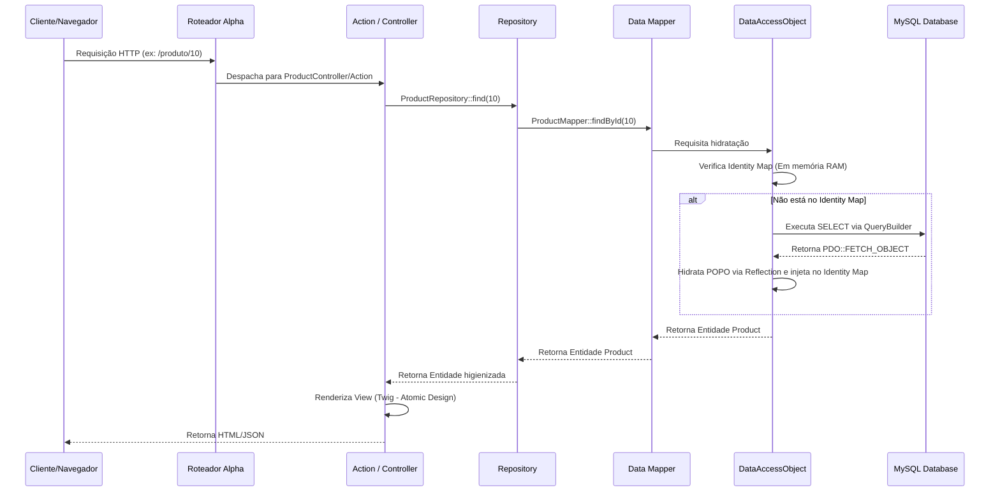

# 🏛️ Alpha Engine - Visão Arquitetural & Guia de Engenharia

Este documento serve como a **única fonte da verdade** para a arquitetura da **Alpha Engine**. Foi otimizado para ser interpretado e validado por Agentes de Inteligência Artificial (como Gemini/Antigravity) e engenheiros de software.

---

## 1. Escopo & Isolamento
A **Alpha Engine** é um ecossistema de e-commerce totalmente independente e autônomo (*standalone*). O código legado foi inteiramente abandonado e atua estritamente como referência conceitual e migração histórica. Toda a execução da aplicação (roteamento, manipulação de sessão, renderização e controle transacional) é nativa da Alpha Engine, garantindo isolamento total via DDD.

---

## 2. Mapa do Workspace (Diretórios Principais)

*   **Ponto de Entrada (Bootstrap):** [`public_html/index.php`](file:///var/www/html/agsonhos/public_html/index.php) (Front-end) e [`public_html/LPDHED2dC7Gjrg2b/index.php`](file:///var/www/html/agsonhos/public_html/LPDHED2dC7Gjrg2b/index.php) (Admin Ofuscado)
*   **Especificações de Contrato (Spec-Driven):** [`docs/specs/`](file:///var/www/html/agsonhos/docs/specs/) (OpenAPI 3.1, JSON Schema DTOs, Gherkin BDD)
*   **Configuração de Rotas:** [`Config/Routes.php`](file:///var/www/html/agsonhos/Config/Routes.php)
*   **Camada de Controladores (Actions):**
    *   **Frontend (E-commerce):** [`core/Controller/Actions/`](file:///var/www/html/agsonhos/core/Controller/Actions/) (Namespace `Alpha\Controller\Actions\`)
    *   **Painel Admin:** [`core/Admin/Controllers/Actions/`](file:///var/www/html/agsonhos/core/Admin/Controllers/Actions/) (Namespace `Alpha\Admin\Controllers\Actions\`)
        *   [`User/User/`](file:///var/www/html/agsonhos/core/Admin/Controllers/Actions/User/User/) - Gestão de Funcionários
        *   [`User/UserGroup/`](file:///var/www/html/agsonhos/core/Admin/Controllers/Actions/User/UserGroup/) - Gestão de Papéis & Permissões
*   **Apresentação (Views Twig):** [`resources/views/`](file:///var/www/html/agsonhos/resources/views/)
*   **Camada de Domínio (DDD):**
    *   **Repositories:** [`core/Model/Domain/Repositories/`](file:///var/www/html/agsonhos/core/Model/Domain/Repositories/) (`UserRepository.php`, `UserGroupRepository.php`, `CartRepository.php`, etc.)
    *   **Domain Entities (POPOs PHP 8.4):** [`core/Model/Domain/Entities/`](file:///var/www/html/agsonhos/core/Model/Domain/Entities/) (`User.php`, `UserGroup.php`)
        *   [`Customer/`](file:///var/www/html/agsonhos/core/Model/Domain/Entities/Customer/) - Entidades de Clientes
        *   [`Supplier/`](file:///var/www/html/agsonhos/core/Model/Domain/Entities/Supplier/) - Entidades de Fornecedores
        *   [`Geo/`](file:///var/www/html/agsonhos/core/Model/Domain/Entities/Geo/) - Entidades Geográficas
*   **Camada de Persistência:**
    *   **Data Mappers:** [`core/Mappers/EntityMappers/`](file:///var/www/html/agsonhos/core/Mappers/EntityMappers/) (`UserMapper.php`, `UserGroupMapper.php`)
    *   **DataAccessObject (DAO):** [`core/Model/DataAccessObject/`](file:///var/www/html/agsonhos/core/Model/DataAccessObject/)
*   **Gerenciador de Container (Legacy & DI):** [`core/AlphaContainer.php`](file:///var/www/html/agsonhos/core/AlphaContainer.php) e [`Containers/AppContainer.php`](file:///var/www/html/agsonhos/Containers/AppContainer.php)

---

## 3. Diretrizes de Governança e Fluxos Arquiteturais

Sempre que atuar no sistema, certifique-se de respeitar o contexto correto (Front-end ou Admin):

###  flujo A: Painel Administrativo (Admin)
```
Slim 4 Route ➔ AdminSessionMiddleware ➔ Action (extends BaseController) ➔ Repository ➔ Mapper ➔ DAO ➔ MySQL
```
*   **Classe Base:** As ações estendem [`BaseController.php`](file:///var/www/html/agsonhos/core/Controller/BaseController.php) e implementam [`ActionInterface.php`](file:///var/www/html/agsonhos/core/Controller/Actions/ActionInterface.php).
*   **Segurança:** A proteção de rotas é delegada ao `AdminSessionMiddleware`.

### fluxo B: Front-end (E-commerce)
```
Slim 4 Route ➔ [SessionMiddleware] ➔ Action (implements ActionInterface) ➔ Repository/Mapper ➔ DAO ➔ MySQL
```
*   **Classe Base:** As ações do front **NÃO** estendem `BaseController`. Elas recebem dependências via **injeção de construtor** (ex: `TwigEnvironment`, `ProductRepository`).
*   **Segurança:** `SessionMiddleware` protege apenas rotas sob `/account/*`.
*   **Internacionalização:** `LanguageMiddleware` roda globalmente e injeta `lang` e traduções no Twig.

> [!IMPORTANT]
> **O que NÃO fazer:**
> 1. Nunca insira consultas SQL brutas ou manipulação direta de cache/Redis fora da infraestrutura de persistência (`DAO` / `Mappers`).
> 2. Não utilize `BaseController` nas Actions de front-end.
> 3. Nunca crie Repositories que acessem a base de dados sem passar pelo `BaseMapper` -> `DataAccessObject` -> `QueryBuilder`.

---

## 4. Padrões de Projeto Aplicados

*   **Repository Pattern:** Abstrai e centraliza a busca e persistência de agregados de negócio. Exemplo: [`CartRepository.php`](file:///var/www/html/agsonhos/core/Model/Domain/Repositories/CartRepository.php).
*   **Data Mapper:** Desacopla as Entidades de Domínio da estrutura do banco. As queries SQL residem inteiramente nos mappers em [`core/Mappers/EntityMappers/`](file:///var/www/html/agsonhos/core/Mappers/EntityMappers/).
*   **Identity Map:** Cache em memória RAM no ciclo de vida do request implementado no [`DataAccessObject.php`](file:///var/www/html/agsonhos/core/Model/DataAccessObject/DataAccessObject.php) para evitar queries N+1 duplicadas.
*   **Proxy Pattern & Lazy Loading:** Relacionamentos complexos (`#[ManyToOne]`, `#[OneToMany]`) utilizam classes Proxy geradas pela [`ProxyFactory.php`](file:///var/www/html/agsonhos/core/Model/DataAccessObject/ProxyFactory.php).
*   **Unit of Work (UoW):** Encapsula o controle de transações (PDO `beginTransaction()`, `commit()`, `rollBack()`) na [`UnitOfWork.php`](file:///var/www/html/agsonhos/core/Model/DataAccessObject/UnitOfWork.php) para atomicidade multi-tabelas.
*   **Atomic Design & Widget Isolation:** Renderização baseada em blocos parciais (Atoms -> Pages) no Twig. O padrão de Widget Isolation impede loops de renderização e telas brancas (WSOD - White Screen of Death).

---

## 5. Tratamento de Integridade e Failsafes (Anti-Patterns Sanados)

A Alpha Engine protege o runtime contra inconsistências do banco de dados legado:

*   **Pseudo-Null (FK = 0):** O banco legado usava `0` para ausência de chave estrangeira. O [`DataAccessObject.php`](file:///var/www/html/agsonhos/core/Model/DataAccessObject/DataAccessObject.php) intercepta a hidratação recursiva e converte `0` para `null`. Adicionalmente, colunas críticas (`parent_id` na categoria, `manufacturer_id` no produto) foram migradas para permitir `NULL` nativo com restrições `FOREIGN KEY` reais.
*   **Session Failsafe (Prevenção de Estouro):** O [`SessionMapper.php`](file:///var/www/html/agsonhos/core/Mappers/EntityMappers/SessionMapper.php) inspeciona o tamanho da sessão via `SELECT LENGTH(data)`. Se for maior que `5MB`, a linha é apagada e a sessão recriada instantaneamente para prevenir crash de RAM.
*   **A "Loja Fantasma" (store_id = 1):** A loja padrão no banco legado usava o ID fictício `0`, gerando falhas de integridade referencial. A Alpha Engine normalizou a tabela `tbkk_store` para registrar e usar permanentemente a loja principal como `store_id = 1`. Fallbacks inseguros para `0` foram substituídos por `RuntimeException`.

---

## 6. Fluxo de Execução Síncrono (Sequência)



---

## 7. Roteamento Centralizado e Internacionalização (I18n)

Todas as rotas estão centralizadas em [`Config/Routes.php`](file:///var/www/html/agsonhos/Config/Routes.php).

### Resolução de URLs no PHP:
Os redirecionamentos são resolvidos dinamicamente usando o parser do Slim 4 obtido pelo `RouteContext`:
```php
$routeContext = Slim\Routing\RouteContext::fromRequest($request);
$routeParser = $routeContext->getRouteParser();
$lang = $request->getAttribute('lang', 'pt-br');

// Redirecionamento dinâmico e seguro:
$redirectUrl = $routeParser->urlFor('login.form', ['lang' => $lang]);
```

### Resolução de URLs no Twig:
O `TwigMiddleware` expõe a função nativa `url` diretamente nos templates:
```twig
<a href="{{ url('login.form', {'lang': lang}) }}">Login</a>
```
