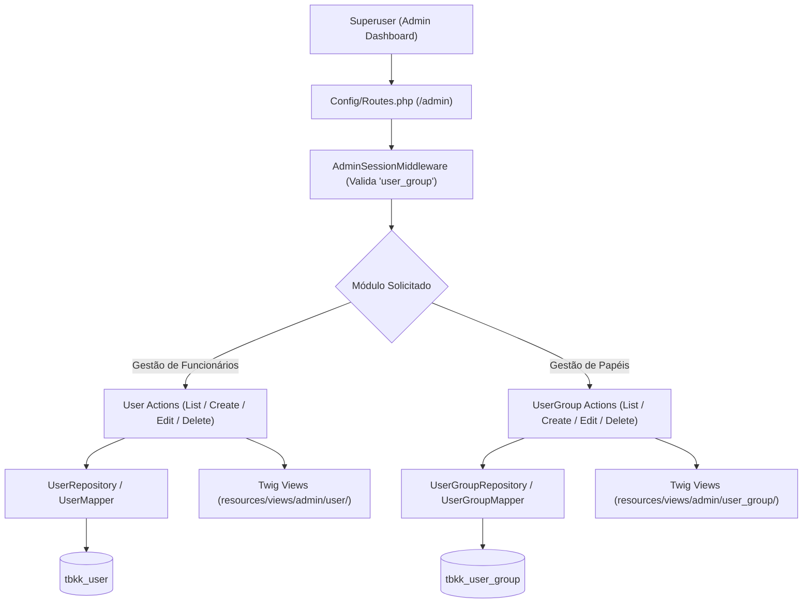

# DP-60: Gestão de Funcionários e Papéis/Permissões no Dashboard Admin

- **Tipo:** Deployment plan
- **Status:** Closed
- **Autor:** [Wattrelos](https://github.com/Wattrelos)
- **Criado em:** 2026-07-30 14:19:56
- **Labels:** Nenhuma
- **Responsáveis:** Wattrelos
- **URL no GitHub:** https://github.com/Wattrelos/Alpha_Engine/issues/60

## Descrição

# Plano de Implementação - Gestão de Funcionários e Papéis/Permissões no Dashboard Admin

Este documento detalha o plano de engenharia para permitir que administradores (superusers) cadastrem, editem e gerenciem **Funcionários (Usuários do Backoffice)** e definam **Papéis/Perfis de Acesso (`UserGroup`)** no painel administrativo da **Alpha Engine**.

---

## User Review Required

> [!IMPORTANT]
> **Controle de Acesso e Autoproteção**:
> 1. O superuser ativo **não poderá excluir a si próprio** nem desativar a própria conta.
> 2. O grupo de usuário `Super Administrator` (ID 1) possui permissões totais imutáveis para evitar bloqueio acidental do painel.
> 3. Um grupo de usuário não poderá ser excluído se existirem funcionários ativos vinculados a ele.

> [!SECURITY]
> **Hashing de Senha e Permissões Estritas**:
> - Todas as senhas de funcionários serão criptografadas via `password_hash($rawPassword, PASSWORD_DEFAULT)`.
> - A verificação de permissões de rotas (`access` e `modify`) será aplicada via `AdminSessionMiddleware`.

---

## Architecture & Proposed Changes



### 1. Camada de Domínio & Persistência (Repositories e Mappers)

#### [MODIFY] [UserRepository.php](/core/Model/Domain/Repositories/UserRepository.php) & [UserMapper.php](/core/Mappers/EntityMappers/UserMapper.php)
- Implementar métodos de persistência e validação:
  - `save(User $user): ?int`: Salva ou atualiza um usuário administrativo gerando hash de senha caso informada.
  - `delete(int $id): bool`: Remove um usuário do banco.
  - `getPaginatedUsers(array $filters, int $page, int $limit)`: Busca filtrada e paginada de funcionários com o relacionamento hidratado do `UserGroup`.

#### [MODIFY] [UserGroupRepository.php](/core/Model/Domain/Repositories/UserGroupRepository.php) & [UserGroupMapper.php](/core/Mappers/EntityMappers/UserGroupMapper.php)
- Implementar métodos de gestão de perfis:
  - `save(UserGroup $userGroup): ?int`: Salva o grupo serializando o array de permissões (`access` e `modify`) em JSON.
  - `delete(int $id): bool`: Remove um grupo garantindo a verificação prévia de que nenhum usuário esteja vinculado.
  - `countUsersInGroup(int $userGroupId): int`: Retorna a quantidade de usuários associados ao grupo.

---

### 2. Camada de Controle Administrativo (Actions Slim)

#### [NEW] Actions de Gestão de Funcionários (`Alpha\Admin\Controllers\Actions\User\User\`)
- **`ListUsersAction`** ([`core/Admin/Controllers/Actions/User/User/ListUsersAction.php`](/core/Admin/Controllers/Actions/User/User/ListUsersAction.php)):
  - Exibe a lista paginada de funcionários cadastrados com filtros por nome, e-mail, grupo e status.
- **`CreateUserAction`** ([`core/Admin/Controllers/Actions/User/User/CreateUserAction.php`](/core/Admin/Controllers/Actions/User/User/CreateUserAction.php)):
  - `GET`: Renderiza o formulário de cadastro de funcionário com o seletor de grupos (`UserGroup`).
  - `POST`: Valida dados (unicidade de username/email, tamanho de senha, obrigatoriedade de grupo) e salva a entidade `User`.
- **`EditUserAction`** ([`core/Admin/Controllers/Actions/User/User/EditUserAction.php`](/core/Admin/Controllers/Actions/User/User/EditUserAction.php)):
  - `GET`: Carrega dados do funcionário.
  - `POST`: Atualiza o perfil do funcionário (com alteração opcional de senha e status).
- **`DeleteUserAction`** ([`core/Admin/Controllers/Actions/User/User/DeleteUserAction.php`](/core/Admin/Controllers/Actions/User/User/DeleteUserAction.php)):
  - Processa a exclusão protegida do funcionário (bloqueando autoexclusão do usuário logado).

#### [NEW] Actions de Gestão de Papéis/Grupos (`Alpha\Admin\Controllers\Actions\User\UserGroup\`)
- **`ListUserGroupsAction`** ([`core/Admin/Controllers/Actions/User/UserGroup/ListUserGroupsAction.php`](/core/Admin/Controllers/Actions/User/UserGroup/ListUserGroupsAction.php)):
  - Exibe a lista de papéis/grupos com a contagem de funcionários associados.
- **`CreateUserGroupAction`** ([`core/Admin/Controllers/Actions/User/UserGroup/CreateUserGroupAction.php`](/core/Admin/Controllers/Actions/User/UserGroup/CreateUserGroupAction.php)):
  - `GET`: Renderiza o formulário de papel exibindo a matriz de permissões das rotas do painel (Visualizar / Modificar).
  - `POST`: Salva o nome do papel e a matriz de permissões serializada.
- **`EditUserGroupAction`** ([`core/Admin/Controllers/Actions/User/UserGroup/EditUserGroupAction.php`](/core/Admin/Controllers/Actions/User/UserGroup/EditUserGroupAction.php)):
  - `GET`/`POST`: Edita nome e permissões do papel.
- **`DeleteUserGroupAction`** ([`core/Admin/Controllers/Actions/User/UserGroup/DeleteUserGroupAction.php`](/core/Admin/Controllers/Actions/User/UserGroup/DeleteUserGroupAction.php)):
  - Remove o papel caso não haja funcionários vinculados.

---

### 3. Rotas Administrativas (`Config/Routes.php`)

#### [MODIFY] [Config/Routes.php](/Config/Routes.php)
Adicionar os grupos de rotas no pipeline protegido do admin:

```php
// Gestão de Funcionários (Usuários Admin)
$group->get('/usuarios', \Alpha\Admin\Controllers\Actions\User\User\ListUsersAction::class)->setName('admin.user.list');
$group->map(['GET', 'POST'], '/usuarios/criar', \Alpha\Admin\Controllers\Actions\User\User\CreateUserAction::class)->setName('admin.user.create');
$group->map(['GET', 'POST'], '/usuarios/{id:[0-9]+}/editar', \Alpha\Admin\Controllers\Actions\User\User\EditUserAction::class)->setName('admin.user.edit');
$group->get('/usuarios/{id:[0-9]+}/excluir', \Alpha\Admin\Controllers\Actions\User\User\DeleteUserAction::class)->setName('admin.user.delete');

// Gestão de Papéis (Grupos de Permissão)
$group->get('/papeis', \Alpha\Admin\Controllers\Actions\User\UserGroup\ListUserGroupsAction::class)->setName('admin.user_group.list');
$group->map(['GET', 'POST'], '/papeis/criar', \Alpha\Admin\Controllers\Actions\User\UserGroup\CreateUserGroupAction::class)->setName('admin.user_group.create');
$group->map(['GET', 'POST'], '/papeis/{id:[0-9]+}/editar', \Alpha\Admin\Controllers\Actions\User\UserGroup\EditUserGroupAction::class)->setName('admin.user_group.edit');
$group->get('/papeis/{id:[0-9]+}/excluir', \Alpha\Admin\Controllers\Actions\User\UserGroup\DeleteUserGroupAction::class)->setName('admin.user_group.delete');
```

---

### 4. Camada de Apresentação (Views Twig)

#### [NEW] Arquivos de View em `resources/views/admin/user/`
- **`user_list.html.twig`**: Tabela responsiva com foto, nome, username, e-mail, papel/grupo, status (Ativo/Inativo) e botões de ação.
- **`user_form.html.twig`**: Formulário com campos de dados pessoais, credenciais (username, senha), upload de imagem, status e dropdown para escolha do papel (`UserGroup`).

#### [NEW] Arquivos de View em `resources/views/admin/user_group/`
- **`user_group_list.html.twig`**: Listagem dos papéis e total de funcionários.
- **`user_group_form.html.twig`**: Formulário para nome do papel e matriz de checkboxes de permissões (Acessar / Modificar) para cada módulo do sistema (Produtos, Pedidos, Clientes, Configurações, PDV, etc.).

---

## Verification Plan

### Automated Tests
- Criar script de teste em [`tests/security_tests/teste_user_management.php`](/tests/security_tests/teste_user_management.php) para validar:
  1. Criação de funcionário com hash de senha seguro.
  2. Proteção contra remoção do superuser ativo.
  3. Validação de salvamento e decodificação das permissões em `UserGroup`.
  4. Impedimento de exclusão de grupo com funcionários vinculados.

### Manual Verification
- Acessar `/admin/usuarios` e cadastrar um novo funcionário (ex: Vendedor para o PDV).
- Acessar `/admin/papeis` e criar um papel customizado com permissões restritas.
- Realizar login com as credenciais do novo funcionário e validar se as permissões de acesso atendem às restrições do papel.

# Lista de Tarefas - Gestão de Funcionários e Papéis/Permissões (`User` & `UserGroup`)

- [x] Implementar métodos de gestão no `UserMapper.php` e `UserRepository.php` (`save`, `delete`, `getPaginatedUsers`)
- [x] Implementar métodos de gestão no `UserGroupMapper.php` e `UserGroupRepository.php` (`save`, `delete`, `countUsersInGroup`)
- [x] Criar Actions de Grupos/Papéis (`ListUserGroupsAction`, `CreateUserGroupAction`, `EditUserGroupAction`, `DeleteUserGroupAction`)
- [x] Criar Actions de Funcionários (`ListUsersAction`, `CreateUserAction`, `EditUserAction`, `DeleteUserAction`)
- [x] Mapear as novas rotas em `Config/Routes.php`
- [x] Criar templates Twig de Grupos/Papéis (`user_group_list.html.twig`, `user_group_form.html.twig`)
- [x] Criar templates Twig de Funcionários (`user_list.html.twig`, `user_form.html.twig`)
- [x] Criar e executar script de testes de integração (`tests/security_tests/teste_user_management.php`)

# Walkthrough - Gestão de Funcionários e Papéis/Permissões (`User` & `UserGroup`)

Concluímos a implementação completa do módulo de **Gestão de Funcionários e Papéis/Permissões** no Dashboard Administrativo da **Alpha Engine**.

## Alterações Realizadas

### 1. Camada de Domínio & Persistência
- **[UserGroupMapper.php](/core/Mappers/EntityMappers/UserGroupMapper.php)** & **[UserGroupRepository.php](/core/Model/Domain/Repositories/UserGroupRepository.php)**:
  - Adicionados métodos `save()`, `delete()` e `countUsersInGroup()`.
  - Atualizada a entidade [`UserGroup.php`](/core/Model/Domain/Entities/UserGroup.php) com a propriedade `$description` e suporte à decodificação das permissões em JSON (`getPermissionArray()`).
- **[UserMapper.php](/core/Mappers/EntityMappers/UserMapper.php)** & **[UserRepository.php](/core/Model/Domain/Repositories/UserRepository.php)**:
  - Adicionados métodos `save()`, `delete()` e `getPaginatedUsers()`.

### 2. Actions do Painel Administrativo
- **Gestão de Papéis e Permissões (`UserGroup`)**:
  - [`ListUserGroupsAction.php`](/core/Admin/Controllers/Actions/User/UserGroup/ListUserGroupsAction.php): Lista os papéis e contagem de funcionários.
  - [`CreateUserGroupAction.php`](/core/Admin/Controllers/Actions/User/UserGroup/CreateUserGroupAction.php): Formulário e salvamento de novos papéis com permissões granulares por módulo (`access` / `modify`).
  - [`EditUserGroupAction.php`](/core/Admin/Controllers/Actions/User/UserGroup/EditUserGroupAction.php): Edição de papéis e matriz de permissões.
  - [`DeleteUserGroupAction.php`](/core/Admin/Controllers/Actions/User/UserGroup/DeleteUserGroupAction.php): Exclusão protegida (bloqueio de exclusão do grupo 1 e de grupos com funcionários vinculados).
- **Gestão de Funcionários (`User`)**:
  - [`ListUsersAction.php`](/core/Admin/Controllers/Actions/User/User/ListUsersAction.php): Tabela paginada com busca e filtros por nome, username, papel e status.
  - [`CreateUserAction.php`](/core/Admin/Controllers/Actions/User/User/CreateUserAction.php): Formulário de cadastro de funcionário com validação e `password_hash`.
  - [`EditUserAction.php`](/core/Admin/Controllers/Actions/User/User/EditUserAction.php): Edição de perfis e alteração opcional de senha/status.
  - [`DeleteUserAction.php`](/core/Admin/Controllers/Actions/User/User/DeleteUserAction.php): Exclusão segura com proteção contra autoexclusão do superuser logado.

### 3. Rotas Administrativas & Views Twig
- **[Config/Routes.php](/Config/Routes.php)**: Mapeadas as rotas `/usuarios` e `/papeis` sob o grupo protegido por `AdminSessionMiddleware`.
- **Views Twig**:
  - [`resources/views/admin/user_group/user_group_list.html.twig`](/resources/views/admin/user_group/user_group_list.html.twig)
  - [`resources/views/admin/user_group/user_group_form.html.twig`](/resources/views/admin/user_group/user_group_form.html.twig)
  - [`resources/views/admin/user/user_list.html.twig`](/resources/views/admin/user/user_list.html.twig)
  - [`resources/views/admin/user/user_form.html.twig`](/resources/views/admin/user/user_form.html.twig)

---

## Verificação e Testes Executados

### Script de Testes Automatizados (`teste_user_management.php`)
Executado o script [`tests/security_tests/teste_user_management.php`](/tests/security_tests/teste_user_management.php):
```bash
php tests/security_tests/teste_user_management.php
```

**Resultado:**
- ✅ **TESTE 1**: Criação e validação de `UserGroup` com serialização e decodificação das permissões JSON.
- ✅ **TESTE 2**: Cadastro de funcionário (`User`) com `password_hash` e validação com `password_verify`.
- ✅ **TESTE 3**: Validação de integridade – contagem de funcionários vinculados e bloqueio de exclusão de papel com usuários atrelados.
- ✅ **TESTE 4**: Limpeza de dados de teste executada com sucesso.

