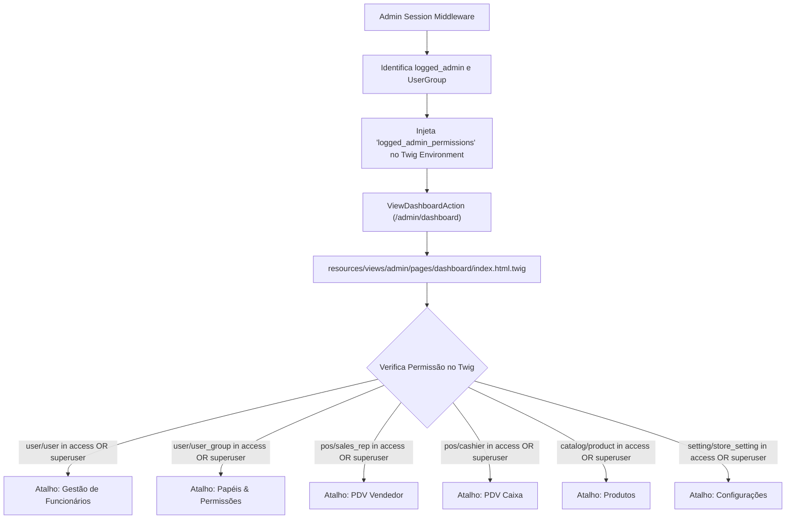

# DP-61: Atalhos Dinâmicos no Dashboard Condicionados ao Papel (`UserGroup`)

- **Tipo:** Deployment plan
- **Status:** Closed
- **Autor:** [Wattrelos](https://github.com/Wattrelos)
- **Criado em:** 2026-07-30 14:33:52
- **Labels:** Nenhuma
- **Responsáveis:** Wattrelos
- **URL no GitHub:** https://github.com/Wattrelos/Alpha_Engine/issues/61

## Descrição

# Plano de Implementação - Atalhos Dinâmicos no Dashboard Condicionados ao Papel (`UserGroup`)

Este plano detalha a inclusão de um painel de **Atalhos Rápidos (Quick Actions Grid)** no Dashboard Administrativo (`/admin/dashboard`), onde a exibição dos cards de ação é **dinamicamente condicionada ao papel (`UserGroup`) do funcionário logado**, garantindo melhor experiência de uso (UX) e respeitando o controle de acesso baseado em funções (RBAC).

---

## User Review Required

> [!IMPORTANT]
> **Por que condicionar os atalhos ao papel do funcionário é a melhor prática?**
> 1. **UX Personalizada**: Cada colaborador (Superuser, Vendedor PDV, Caixa, Gerente de Estoque) visualiza no Dashboard apenas as ferramentas pertinentes à sua rotina de trabalho.
> 2. **Prevenção de Erros de Acesso (403 Forbidden)**: Evita que um funcionário clique em um atalho para um módulo (ex: Gestão de Funcionários) para o qual não possui permissão de leitura (`access`), prevenindo telas de erro defensivas.
> 3. **Superuser Bypass (`user_group_id = 1`)**: Administradores com `user_group_id = 1` visualizam a totalidade dos atalhos.

---

## Architecture & Proposed Changes

### 1. Middleware & Context Ingestion

#### [MODIFY] [AdminSessionMiddleware.php](/core/Auth/Middleware/AdminSessionMiddleware.php)
- Atualizar `ROUTE_PERMISSION_MAP` para incluir os mapeamentos das novas rotas:
  - `'admin.user.list' => 'user/user'`
  - `'admin.user.create' => 'user/user'`
  - `'admin.user.edit' => 'user/user'`
  - `'admin.user.delete' => 'user/user'`
  - `'admin.user_group.list' => 'user/user_group'`
  - `'admin.user_group.create' => 'user/user_group'`
  - `'admin.user_group.edit' => 'user/user_group'`
  - `'admin.user_group.delete' => 'user/user_group'`
- Carregar o `UserGroup` do usuário logado e injetar as permissões (`access` e `modify`) e o nome do grupo como variáveis globais do Twig:
  - `logged_admin_permissions`
  - `logged_admin_group_name`

---

### 2. Dashboard Action & Template

#### [MODIFY] [ViewDashboardAction.php](/core/Admin/Controllers/Actions/Dashboard/ViewDashboardAction.php)
- Garantir a passagem das permissões e contexto do usuário logado para a renderização do template do dashboard.

#### [MODIFY] [index.html.twig](/resources/views/admin/pages/dashboard/index.html.twig)
- Adicionar a seção de **Atalhos Rápidos do Sistema** com grid responsivo de cartões interativos.
- Aplicar condicionais Twig `` em cada atalho:
  - 👥 **Funcionários**: `/admin/usuarios` (`user/user`)
  - 🛡️ **Papéis & Permissões**: `/admin/papeis` (`user/user_group`)
  - 🛍️ **Produtos**: `/admin/produtos` (`catalog/product`)
  - 🛒 **PDV Vendedor**: `/admin/pos/vendedor` (`pos/sales_rep`)
  - 💵 **PDV Caixa**: `/admin/pos/caixa` (`pos/cashier`)
  - 📦 **Fornecedores**: `/admin/fornecedores` (`procurement/supplier`)
  - 🏷️ **Categorias**: `/admin/categorias` (`catalog/category`)
  - ⚙️ **Configurações**: `/admin/configuracoes` (`setting/store_setting`)

---

## Verification Plan

### Automated Tests
- Atualizar e executar o script de testes [`teste_user_management.php`](/tests/security_tests/teste_user_management.php) para validar a resolução de permissões por grupo e rotas admin.

### Manual Verification
- Acessar `/admin/dashboard` com perfil **Super Administrator** e verificar se todos os atalhos são renderizados.
- Acessar com perfil **Vendedor PDV** e verificar se apenas os atalhos autorizados (ex: PDV Vendedor, Produtos) aparecem no painel.

# Lista de Tarefas - Atalhos Dinâmicos no Dashboard Condicionados ao Papel

- [x] Atualizar `AdminSessionMiddleware.php` com mapeamento de rotas `user/user` e `user/user_group` e injeção global de `logged_admin_permissions` no Twig
- [x] Atualizar `ViewDashboardAction.php` para integrar contextualmente com a sessão do usuário
- [x] Modificar `resources/views/admin/pages/dashboard/index.html.twig` com o grid de atalhos rápidos e condicionais Twig por papel
- [x] Executar suíte de testes de integração (`teste_user_management.php` e suíte de segurança)

# Walkthrough - Atalhos Rápidos no Dashboard Condicionados ao Papel (`UserGroup`)

Concluímos a inclusão da seção de **Atalhos Rápidos do Sistema (Quick Actions Grid)** no Dashboard Administrativo ([`index.html.twig`](/resources/views/admin/pages/dashboard/index.html.twig)), com condicionamento dinâmico baseado no papel (`UserGroup`) do colaborador logado.

## Alterações Realizadas

### 1. Injeção de Contexto & Segurança Middleware
- **[AdminSessionMiddleware.php](/core/Auth/Middleware/AdminSessionMiddleware.php)**:
  - Adicionado o mapeamento de permissões para as rotas de usuários (`user/user`) e papéis (`user/user_group`).
  - Injetada a variável global `logged_admin_permissions` no Twig com o mapa de permissões de leitura (`access`) e escrita (`modify`).
  - Aplicado o bypass de superuser para o grupo `user_group_id = 1` (Super Administrator).

### 2. Grid de Atalhos Rápidos no Dashboard
- **[index.html.twig](/resources/views/admin/pages/dashboard/index.html.twig)**:
  - Adicionado o grid de atalhos logo abaixo do painel de métricas.
  - Aplicadas validações Twig contextuais para exibição dinâmica:
    - 👥 **Funcionários** (`/admin/usuarios`): `user/user`
    - 🛡️ **Papéis & Permissões** (`/admin/papeis`): `user/user_group`
    - 🛒 **PDV Vendedor** (`/admin/pos/vendedor`): `pos/sales_rep`
    - 💵 **PDV Caixa** (`/admin/pos/caixa`): `pos/cashier`
    - 🛍️ **Produtos** (`/admin/produtos`): `catalog/product`
    - 📦 **Fornecedores** (`/admin/fornecedores`): `procurement/supplier`
    - ⚙️ **Configurações** (`/admin/configuracoes`): `setting/store_setting`

---

## Verificação e Resultado
- Executado o script [`teste_user_management.php`](/tests/security_tests/teste_user_management.php) e a suíte de segurança completa.
- Verificado o comportamento responsivo e a ocultação automática de cartões de ação para perfis sem permissão de acesso.

