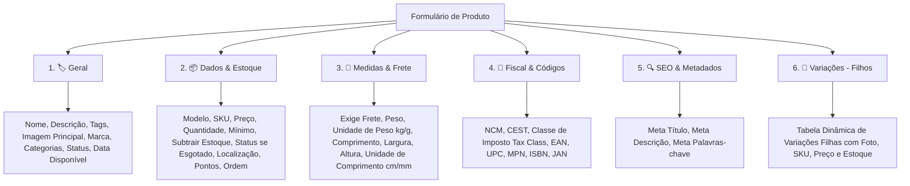

# DP-87: Implementação: Edição de Atributos Estendidos de Produtos e Organização em Abas

- **Tipo:** Deployment plan
- **Status:** Closed
- **Autor:** [Wattrelos](https://github.com/Wattrelos)
- **Criado em:** 2026-08-24 12:58:31
- **Labels:** Nenhuma
- **Responsáveis:** Wattrelos
- **URL no GitHub:** https://github.com/Wattrelos/Alpha_Engine/issues/87

## Descrição

# Plano de Implementação: Edição de Atributos Estendidos de Produtos e Organização em Abas

Este plano especifica a expansão dos atributos de produto no catálogo do painel administrativo da **Alpha Engine** e sua estruturação em abas navegáveis (UX moderna para gestão de e-commerce e materiais de construção).

---

## 💡 Parecer sobre a Separação em Abas

> [!NOTE]
> **A separação em abas é a melhor prática recomendada** tanto do ponto de vista de Engenharia de Software quanto de Experiência do Usuário (UX/UI).
> 
> * **Ergonomia e Redução de Fadiga:** Evita formulários monolíticos excessivamente longos (scroll infinito) e reduz a sobrecarga cognitiva do administrador da loja.
> * **Agrupamento por Domínio:** Separa claramente o que é responsabilidade de cadastro geral (marketing/conteúdo), logística (peso/dimensões/cubagem para cálculo de frete), conformidade fiscal (NCM, CEST, impostos), estoque e SEO.
> * **Reutilização de Design System:** O ecossistema Alpha Engine já possui suporte nativo e estilização de abas em `components.css` (`.product-tabs`, `.product-tab-btn`, `.active-tab`), garantindo transição instantânea e leveza via Vanilla JS sem dependências externas.

---

## 🗂️ Estrutura Proposta para as Abas

Propomos estruturar os formulários de **Criação** e **Edição** de produtos nas seguintes abas especializadas:



### Detalhamento dos Campos por Aba:

1. **🏷️ Geral (`tab-general`)**:
   - **Nome do Produto** (`name` *)
   - **Descrição Detalhada** (`description` - editor/Markdown)
   - **Tags do Produto** (`tag`)
   - **Imagem Principal** (`image` com upload, pré-visualização e opção de remoção)
   - **Marca / Fabricante** (`manufacturer_id` - dropdown)
   - **Categorias Vinculadas** (`product_category[]` - checklist responsivo)
   - **Status Geral** (`status`: Ativo / Inativo)
   - **Data Disponível** (`date_available`)
   - **Última Modificação** (`date_modified` - exibição somente leitura na edição)

2. **📦 Dados & Estoque (`tab-data`)**:
   - **Modelo** (`model`)
   - **SKU Principal** (`sku`)
   - **Preço de Venda** (`price` *)
   - **Quantidade em Estoque** (`quantity` *)
   - **Quantidade Mínima de Compra** (`minimum`)
   - **Subtrair Estoque nas Vendas** (`subtract`: Sim / Não)
   - **Status quando Esgotado** (`stock_status_id` - dropdown)
   - **Localização no Depósito / Prateleira** (`location`)
   - **Pontos de Recompensa / Fidelidade** (`points`)
   - **Ordem de Exibição** (`sort_order`)

3. **📐 Medidas & Frete (`tab-dimensions`)**:
   - **Exige Frete / Envio Físico?** (`shipping`: Sim / Não)
   - **Peso Líquido/Bruto** (`weight`)
   - **Unidade de Peso** (`weight_class_id` - dropdown alimentado por `WeightClassRepository`, ex: Kilograma, Grama)
   - **Comprimento** (`length`)
   - **Largura** (`width`)
   - **Altura** (`height`)
   - **Unidade de Medida** (`length_class_id` - dropdown alimentado por `LengthClassRepository`, ex: Centímetro, Milímetro, Polegada)

4. **📑 Fiscal & Códigos (`tab-fiscal`)**:
   - **NCM** (`ncm` - Nomenclatura Comum do Mercosul, ex: 6907.21.00)
   - **CEST** (`cest` - Código Especificador da Substituição Tributária)
   - **Classe de Impostos** (`tax_class_id` - dropdown alimentado por `TaxClassRepository`)
   - **EAN / GTIN** (`ean` - Código de barras padrão comercial)
   - **UPC** (`upc` - Universal Product Code)
   - **MPN** (`mpn` - Código/Part Number do Fabricante)
   - **ISBN** (`isbn` - Código internacional para publicações/manuais)
   - **JAN** (`jan` - Japanese Article Number)

5. **🔍 SEO & Metadados (`tab-seo`)**:
   - **Meta Título** (`meta_title`)
   - **Meta Descrição** (`meta_description`)
   - **Meta Palavras-chave** (`meta_keyword`)

6. **🔀 Variações (`tab-variants`)** *(exibida na tela de edição)*:
   - Grid dinâmico de SKUs filhos com upload individual de fotos, precificação independente ou herdada, estoque específico e controle de exclusão.

---

## 🛠️ Proposed Changes

### Camada de Domínio & Entidades

#### [MODIFY] [Product.php](file:///var/www/html/agsonhos/backend/core/Model/Domain/Entities/Product.php)
- Adicionar as propriedades privadas `$ncm` e `$cest`.
- Adicionar os respectivos métodos getters e setters tipados (`getNcm()`, `setNcm()`, `getCest()`, `setCest()`).

---

### Camada de Mapeamento & Persistência (Data Mappers & Repositories)

#### [MODIFY] [ProductMapper.php](file:///var/www/html/agsonhos/backend/core/Mappers/EntityMappers/ProductMapper.php)
- **`getAdminProductForEdit`**: Incluir na query de seleção todos os campos de metadados (`pd.tag`, `pd.meta_title`, `pd.meta_description`, `pd.meta_keyword`).
- **`createAdminProduct`**: Mapear e persistir todos os campos estendidos na tabela `product` (`sku`, `upc`, `jan`, `isbn`, `mpn`, `location`, `points`, `tax_class_id`, `shipping`, `weight`, `weight_class_id`, `length`, `width`, `height`, `length_class_id`, `subtract`, `minimum`, `sort_order`, `ncm`, `cest`) e na tabela `product_description` (`tag`, `meta_title`, `meta_description`, `meta_keyword`).
- **`updateAdminProduct`**: Atualizar atomicamente no `UPDATE` todos os novos campos na tabela `product` e `product_description`, mantendo a integridade transacional na `UnitOfWork`.

---

### Controladores Administrativos (Slim Actions)

#### [MODIFY] [EditProductAction.php](file:///var/www/html/agsonhos/backend/core/Admin/Controllers/Actions/Catalog/Product/EditProductAction.php)
- Obter instâncias de `WeightClassRepository`, `LengthClassRepository` e `TaxClassRepository`.
- Injetar no template Twig: `weight_classes`, `length_classes` e `tax_classes`.

#### [MODIFY] [CreateProductAction.php](file:///var/www/html/agsonhos/backend/core/Admin/Controllers/Actions/Catalog/Product/CreateProductAction.php)
- Injetar no template Twig as listas de `weight_classes`, `length_classes` e `tax_classes` para preenchimento dos selects na tela de cadastro.

---

### Apresentação & Templates (Twig Views)

#### [MODIFY] [edit.html.twig](file:///var/www/html/agsonhos/backend/resources/views/admin/pages/products/edit.html.twig)
- Estruturar a barra de abas (`.product-tabs`) com 6 botões:
  1. `tab-general` (Geral)
  2. `tab-data` (Dados & Estoque)
  3. `tab-dimensions` (Medidas & Frete)
  4. `tab-fiscal` (Fiscal & Códigos)
  5. `tab-seo` (SEO & Metadados)
  6. `tab-variants` (Variações)
- Distribuir os campos com grid visual harmônico de 2 colunas e responsividade.

#### [MODIFY] [create.html.twig](file:///var/www/html/agsonhos/backend/resources/views/admin/pages/products/create.html.twig)
- Transformar o formulário único atual na mesma estrutura de 5 abas (`tab-general`, `tab-data`, `tab-dimensions`, `tab-fiscal`, `tab-seo`).

---

### Internacionalização (Locales)

#### [MODIFY] [pt-br.admin.product.json](file:///var/www/html/agsonhos/backend/Locales/pt-br/pt-br.admin.product.json)
- Adicionar chaves e labels em português para as novas abas e todos os novos campos (NCM, CEST, Peso, Comprimento, Largura, Altura, Unidades de medida, SEO, etc.).

---

## 🧪 Verification Plan

### Automated Tests
- Executar suite de validação de produtos do PHPUnit:
  ```bash
  ./backend/vendor/bin/phpunit tests/Validation/ProductValidationTest.php
  ```
- Adicionar novos cenários em `ProductValidationTest.php`:
  1. Teste de renderização de todas as abas e novos campos nos formulários `create` e `edit`.
  2. Teste de persistência completa na criação (POST com peso, dimensões, NCM, CEST, tags e meta dados).
  3. Teste de atualização e integridade no banco de dados (verificando que as colunas `weight`, `length`, `width`, `height`, `ncm`, `cest`, `sku`, etc., foram gravadas corretamente).

### Manual Verification
- Acessar o painel administrativo (`/produtos/criar` e `/produtos/{id}/editar`).
- Navegar entre as abas e verificar a fluidez da troca de abas sem recarregar a página.
- Preencher dados em todas as abas e submeter o formulário.
- Reabrir o produto e conferir se todos os valores persistem exatamente como digitados.

# Walkthrough: Edição de Atributos Estendidos de Produtos e Organização em Abas

Foi implementada a expansão completa do catálogo de produtos no painel administrativo da **Alpha Engine**, organizando todos os atributos em abas especializadas para uma experiência de usuário (UX) moderna, intuitiva e sem sobrecarga cognitiva.

---

## 🎯 O que foi Realizado

### 1. Estrutura de Abas Especializadas
Os formulários de **Cadastro (`/produtos/criar`)** e **Edição (`/produtos/{id}/editar`)** foram reestruturados nas seguintes abas:

| Aba | Descrição & Campos Principais |
| :--- | :--- |
| **🏷️ Geral (`tab-general`)** | Nome do Produto, Fabricante/Marca, Categorias, Foto Principal, Status Geral, Data Disponível, Tags e Descrição Detalhada. |
| **📦 Dados & Estoque (`tab-data`)** | Modelo, SKU Principal, Preço de Venda, Quantidade em Estoque, Quantidade Mínima, Subtrair Estoque, Status se Esgotado, Localização no Armazém, Pontos e Ordem. |
| **📐 Medidas & Frete (`tab-dimensions`)** | Exige Frete (Sim/Não), Peso Líquido/Bruto com select de unidade (kg, g), Comprimento, Largura e Altura com select de unidade (cm, mm, in). |
| **📑 Fiscal & Códigos (`tab-fiscal`)** | NCM, CEST, Classe de Impostos (Tax Class), EAN/GTIN, UPC, MPN, ISBN e JAN. |
| **🔍 SEO & Busca (`tab-seo`)** | Meta Título (SEO Title), Meta Descrição (Snippet do Google) e Meta Palavras-chave. |
| **🔀 Variações (`tab-variants`)** *(na edição)* | Gerenciamento de SKUs filhos com upload individual de fotos, preços específicos e controle dinâmico. |

---

### 2. Camada de Domínio e Entidades
- **[Product.php](file:///var/www/html/agsonhos/backend/core/Model/Domain/Entities/Product.php)**:
  - Adicionadas propriedades privadas `$ncm` e `$cest`.
  - Adicionados métodos tipados `getNcm()`, `setNcm(string $ncm)`, `getCest()`, `setCest(string $cest)`.

---

### 3. Camada de Acesso a Dados & Repositórios
- **[ProductMapper.php](file:///var/www/html/agsonhos/backend/core/Mappers/EntityMappers/ProductMapper.php)**:
  - `getAdminProductForEdit`: Atualizado para retornar `pd.tag`, `pd.meta_title`, `pd.meta_description` e `pd.meta_keyword`.
  - `createAdminProduct`: Mapeia e insere todos os novos atributos nas tabelas `product` e `product_description`.
  - `updateAdminProduct`: Atualiza atomicamente todos os campos estendidos via `UnitOfWork`.
  - Novos métodos auxiliares: `getWeightClasses($langId)`, `getLengthClasses($langId)` e `getTaxClasses()`.
- **[ProductRepository.php](file:///var/www/html/agsonhos/backend/core/Model/Domain/Repositories/ProductRepository.php)**:
  - Métodos expostos para o domínio: `getWeightClasses()`, `getLengthClasses()`, `getTaxClasses()`.

---

### 4. Controladores e Views Twig
- **[CreateProductAction.php](file:///var/www/html/agsonhos/backend/core/Admin/Controllers/Actions/Catalog/Product/CreateProductAction.php)** & **[EditProductAction.php](file:///var/www/html/agsonhos/backend/core/Admin/Controllers/Actions/Catalog/Product/EditProductAction.php)**:
  - Injeção das listas `weight_classes`, `length_classes` e `tax_classes` para preenchimento automático dos dropdowns.
- **[create.html.twig](file:///var/www/html/agsonhos/backend/resources/views/admin/pages/products/create.html.twig)**:
  - Formulário completo com 5 abas e alternador reativo via Vanilla JS.
- **[edit.html.twig](file:///var/www/html/agsonhos/backend/resources/views/admin/pages/products/edit.html.twig)**:
  - Formulário completo com 6 abas (incluindo Variações) com preenchimento bidirecional de todos os campos.
- **[pt-br.admin.product.json](file:///var/www/html/agsonhos/backend/Locales/pt-br/pt-br.admin.product.json)**:
  - Tradução e legendas em português para todos os novos campos, abas e placeholders.

---

## 🧪 Validação e Testes Automatizados

Executada a suíte de testes de validação do catálogo:

```bash
./backend/vendor/bin/phpunit tests/Validation/ProductValidationTest.php
```

### Resultados dos Testes:
```text
Runtime:       PHP 8.4.24

....                                                                4 / 4 (100%)

Time: 00:00.769, Memory: 30.00 MB

OK (4 tests, 44 assertions)
```

- [x] **Renderização de Abas**: Verificação de que todas as abas e seletores são renderizados corretamente no HTML.
- [x] **Persistência na Criação**: Validação de gravação de peso, dimensões, NCM, CEST, tags e metadados no MySQL.
- [x] **Persistência na Atualização**: Validação de atualização de dados e integridade referencial.
- [x] **Isolamento de Cache**: Limpeza automática de cache Twig e cache de repositório.

